## 버전 정보

### 프론트

- node 22.13
- React (Vite) 18
- VS Code

### 백엔드

- Spring Boot
- JDK 17
- JAR 이용
- IntelliJ 최신 버전 이용
- 제공된 AWS 서버 사용
- OpenVidu 2.31
- Redis 7.4.2
- MySQL 8.4.4
- 젠킨스

### AI
- FastAPI
- OpenAI (GPT-4o-mini)
- LangChain

## 시연 시나리오
### AI 스몰톡
<table>
  <tr>
    <th>1</th>
    <th>2</th>
    <th>3</th>
  </tr>
  <tr>
    <td>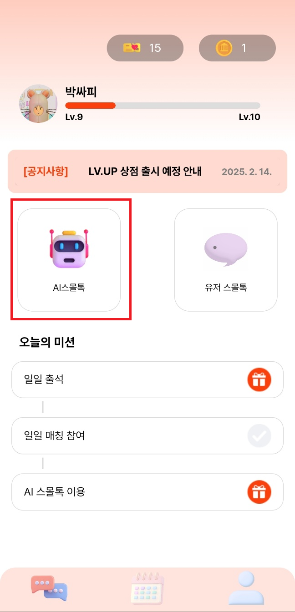</img></td>
    <td>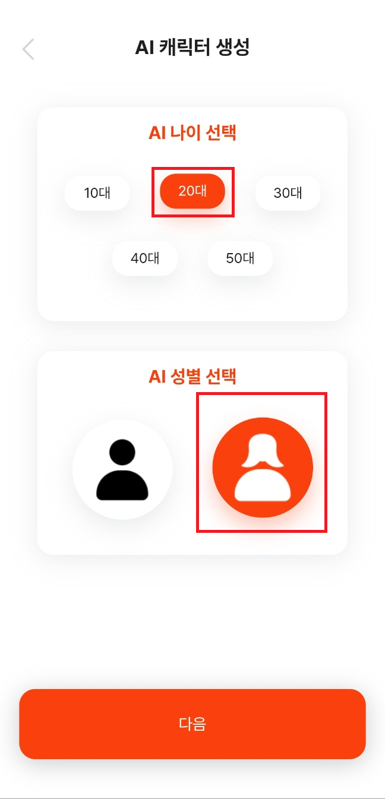</img></td>
    <td>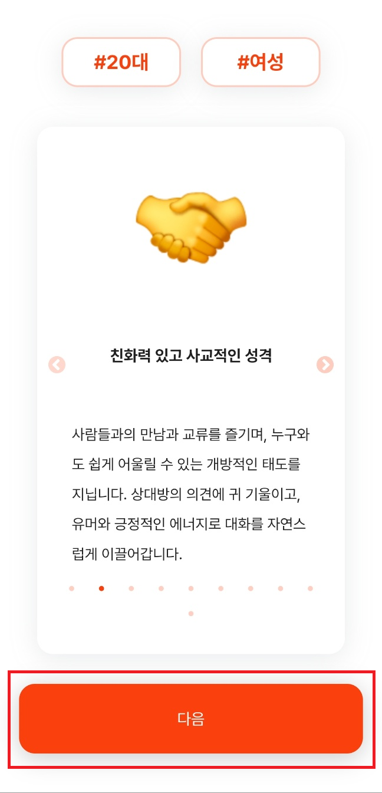</img></td>
  </tr>
  <tr>
    <th>4</th>
    <th>5</th>
  </tr>
  <tr>
    <td>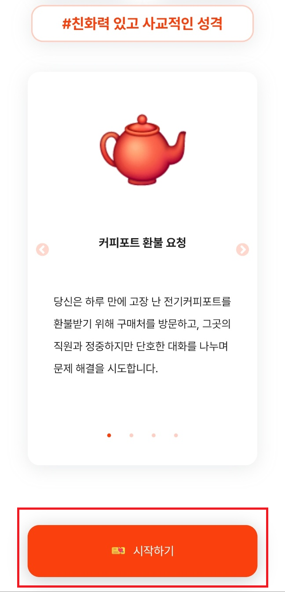</img></td>
    <td>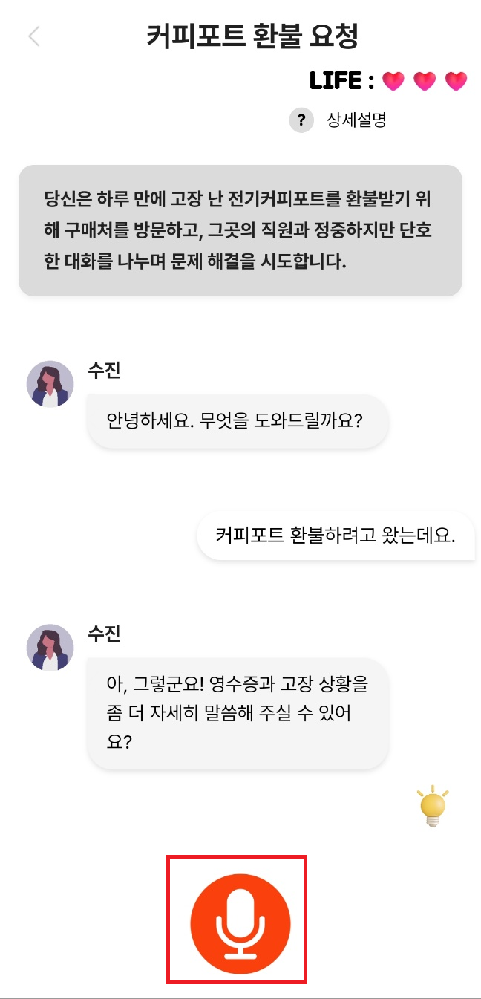</img></td>
  </tr>
</table>

### 유저 스몰톡
<table>
  <tr>
    <th>1</th>
    <th>2</th>
    <th>3</th>
  </tr>
  <tr>
    <td>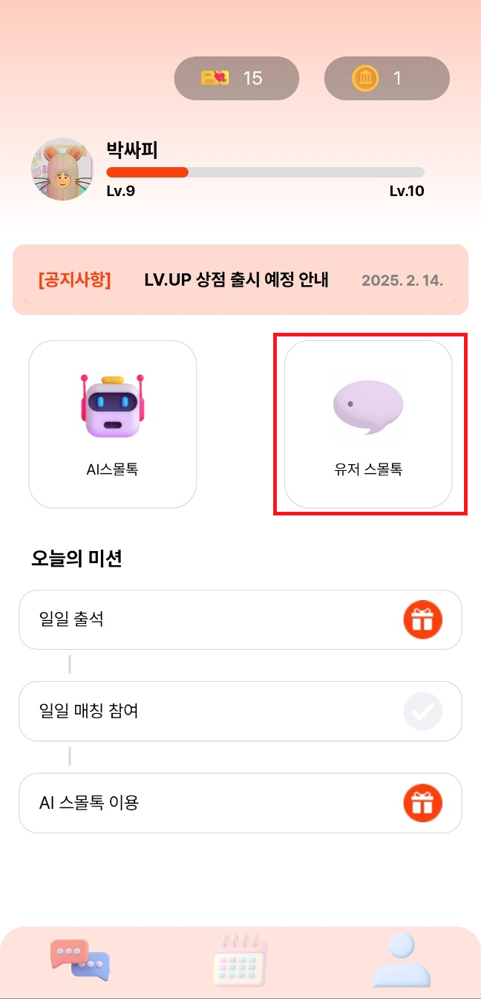</img></td>
    <td>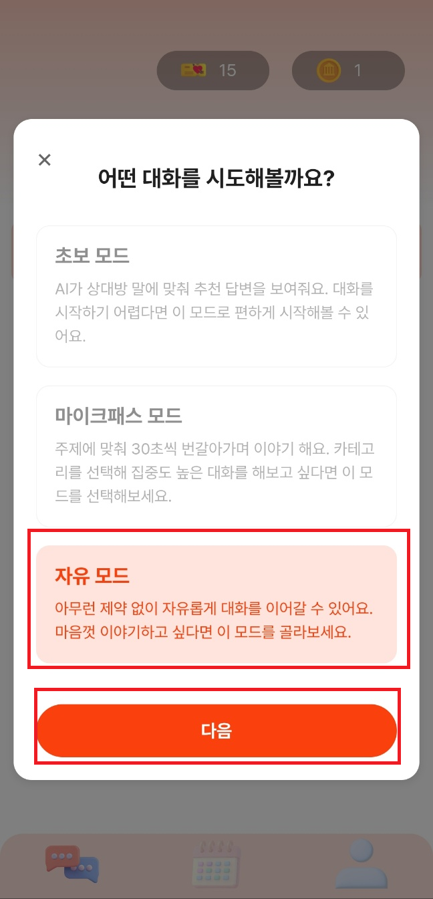</img></td>
    <td>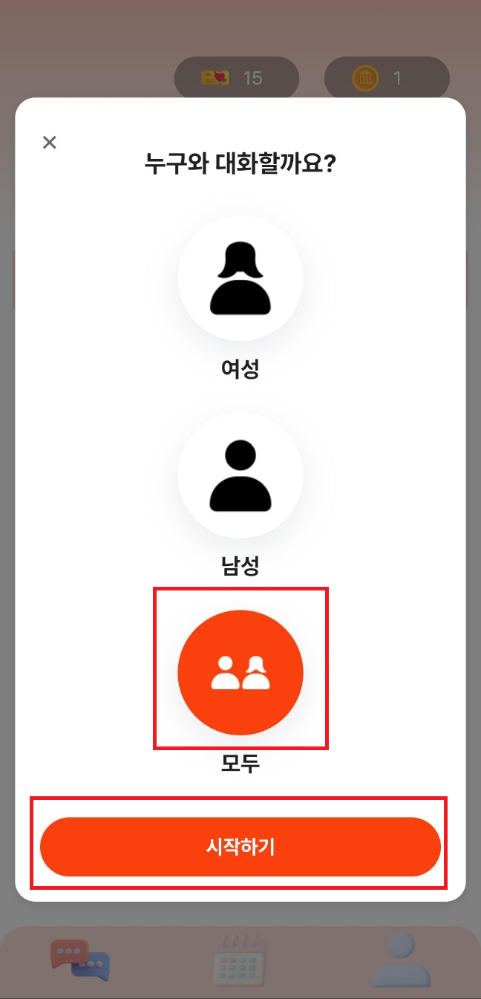</img></td>
  </tr>
  <tr>
    <th>4</th>
    <th>5</th>
    <th>6</th>
  </tr>
  <tr>
    <td>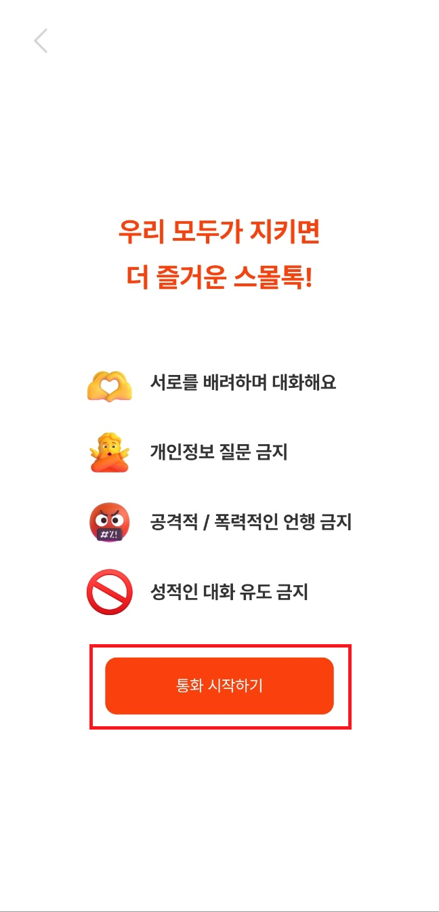</img></td>
    <td></img></td>
    <td>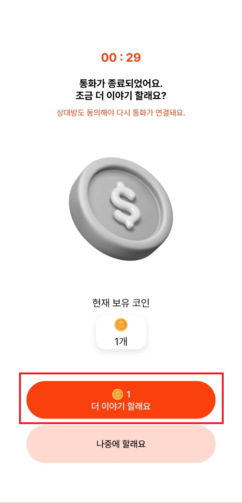</img></td>
  </tr>
  <tr>
    <th>7</th>
    <th>8</th>
  </tr>
  <tr>
    <td>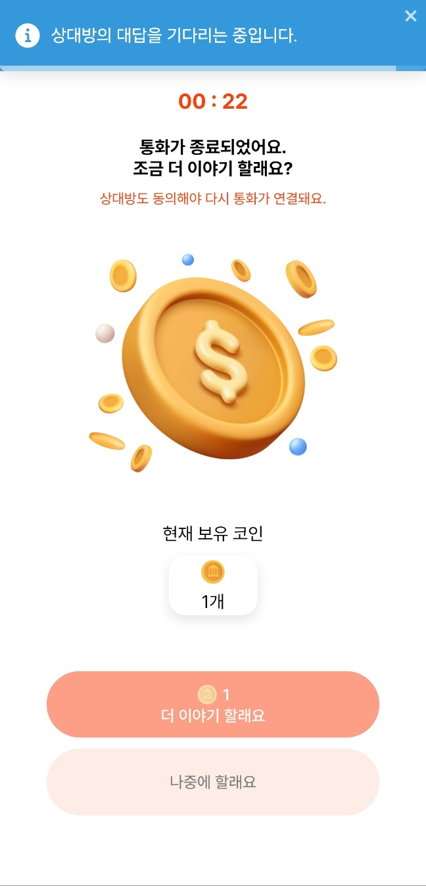</img></td>
    <td>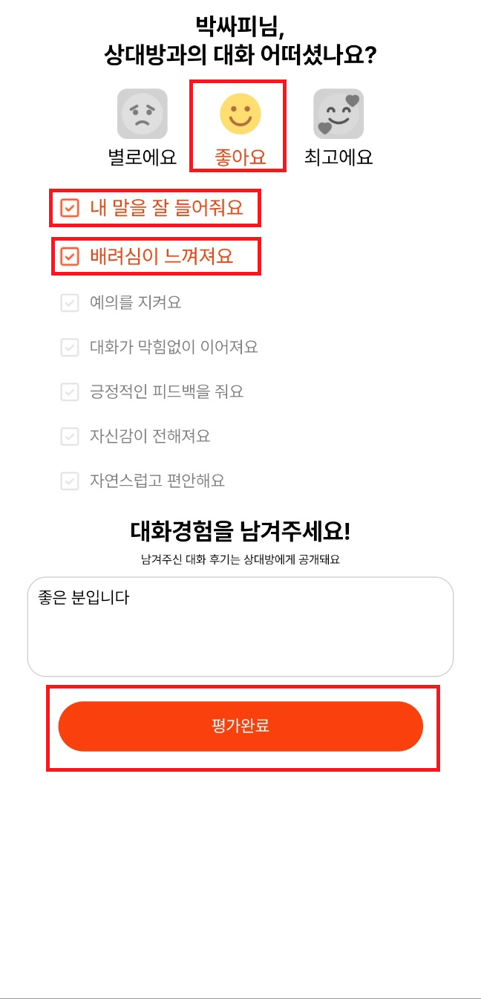</img></td>
  </tr>
</table>

### 매칭 기록
<table>
  <tr>
    <th>1</th>
    <th>2</th>
    <th>3</th>
  </tr>
  <tr>
    <td>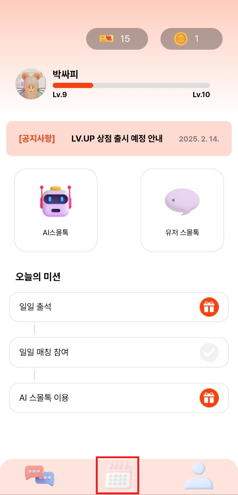</img></td>
    <td>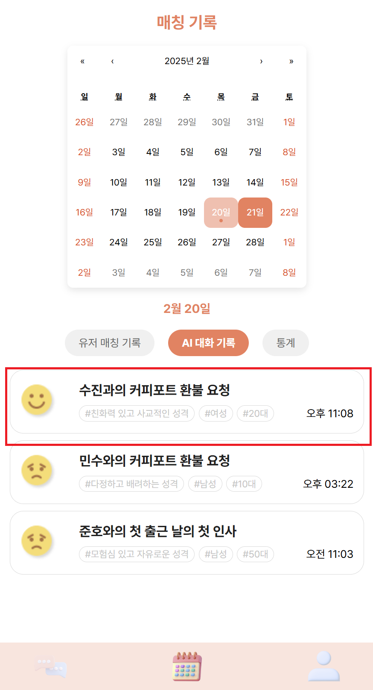</img></td>
    <td>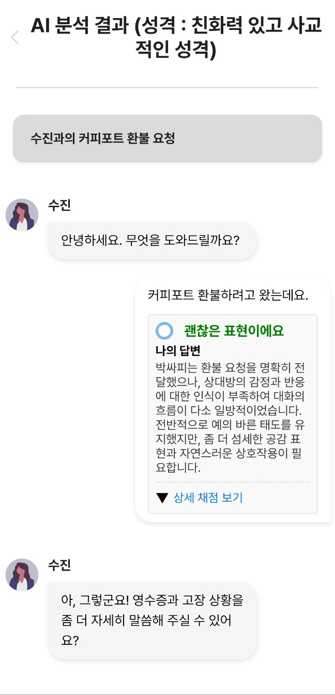</img></td>
  </tr>
  <tr>
    <th>4</th>
    <th>5</th>
  </tr>
  <tr>
    <td>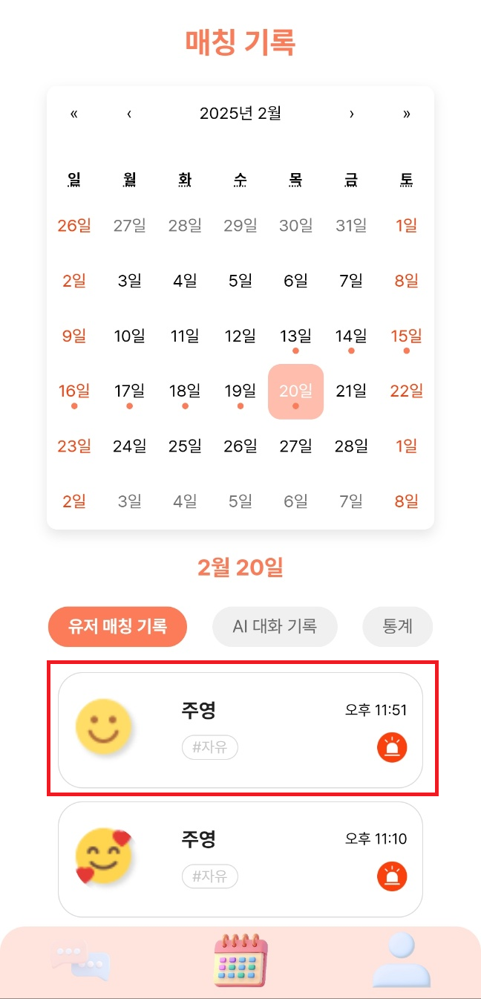</img></td>
    <td>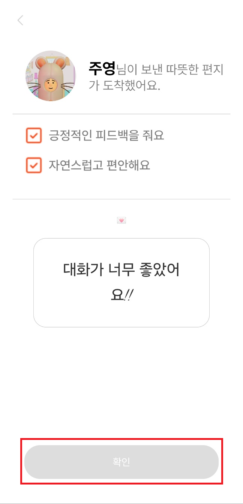</img></td>
  </tr>
</table>

### 미션 기능
<table>
  <tr>
    <th>1</th>
    <th>2</th>
  </tr>
  <tr>
    <td>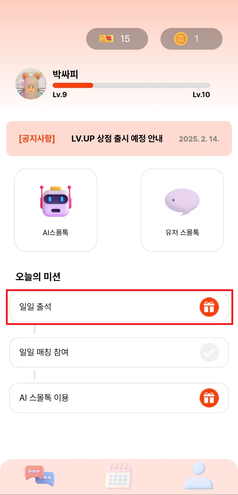</img></td>
    <td>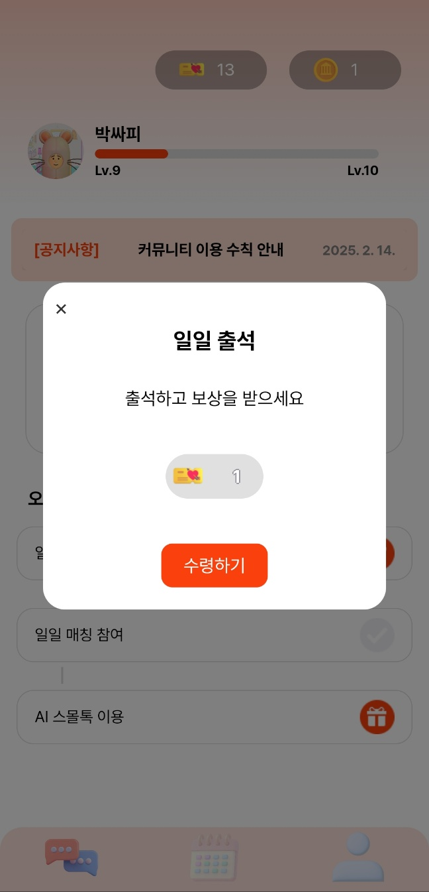</img></td>
  </tr>
</table>
